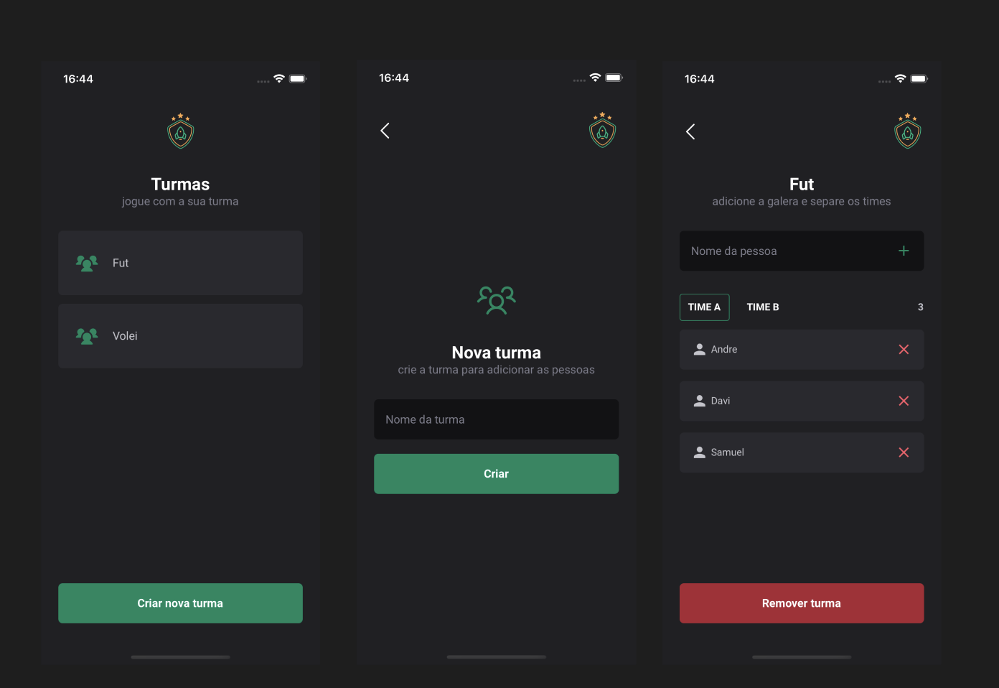

<p align="center">
  <a href="#-tecnologias">Tecnologias</a>&nbsp;&nbsp;&nbsp;|&nbsp;&nbsp;&nbsp;
  <a href="#-projeto">Projeto</a>&nbsp;&nbsp;&nbsp;|&nbsp;&nbsp;&nbsp;
  <a href="#-layout">Layout</a>&nbsp;&nbsp;&nbsp;|&nbsp;&nbsp;&nbsp;
  <a href="#-como-executar">Como executar</a>&nbsp;&nbsp;&nbsp;
</p>
<br>

## ✨ Technologies

This project was developed using the following technologies:

- [React Native](https://reactnative.dev/)
- [TypeScript](https://www.typescriptlang.org/)
- [Expo](https://expo.dev/)
- [Styled Components](https://styled-components.com/)

## 💻 Projeto

Ignite Teams is an innovative mobile application developed during the Ignite bootcamp by Rocketseat, employing the best practices of mobile development. Its main functionality is to create classes and allocate players into different teams. It's important to note that the app does not use an external database; all data is stored directly on the user's device.

## 🔖 Layout
<p align="center">
  
</p>

## Starting

```bash
# Clone this project
$ git clone https://github.com/Loureiro12/Ignite-Teams.git

# Access
$ cd ignite-Teams

# Install dependencies
$ yarn

# Run the project
$ npx expo start

# The server will initialize in the <http://localhost:3000>
```

## License

This project is under license from MIT. For more details, see the [LICENSE](LICENSE.md) file.

Made with 💜 by <a href="https://github.com/Loureiro12" target="_blank">André Loureiro </a>

&#xa0;

<a href="#top">Back to top</a>